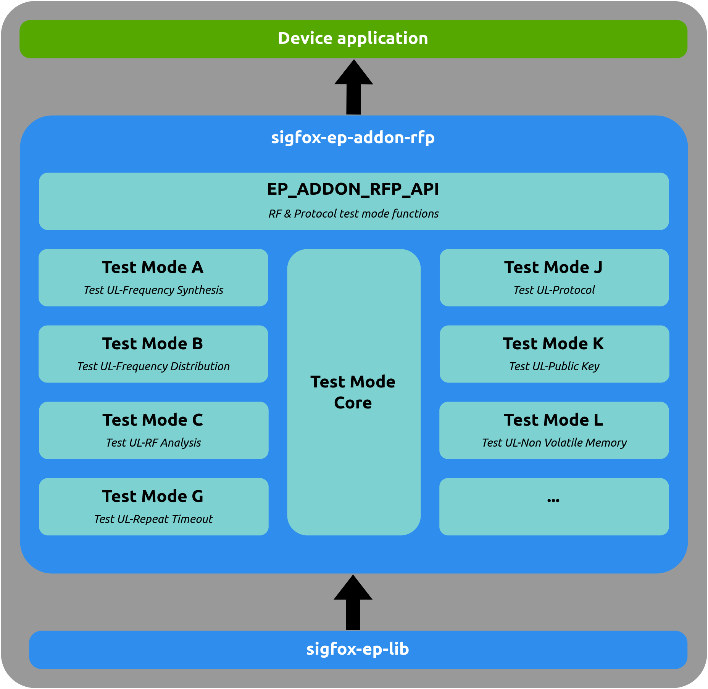

# Sigfox End-Point RF & Protocol addon (EP_ADDON_RFP)

## Description

This **Sigfox End-Point RF & Protocol addon** show an exemple of the [RF & Protocol test](https://support.sigfox.com/docs/rf-protocol-test-specification)  implementation. This addon is an application of the [EP LIB](https://github.com/sigfox-tech-radio/sigfox-ep-lib)  to offers a new API provided in the "sigfox_ep_addon_rfp_api.h" to execute different tests mode.
The table below shows the compatibility between EP_ADDON_RFP and EP_LIB version.

|                                  **EP_ADDON_RFP**                                  |                                  **EP_LIB**                                     |
|:----------------------------------------------------------------------------------:|:-------------------------------------------------------------------------------:|
| [v1.0](https://github.com/sigfox-tech-radio/sigfox-ep-addon-rfp/releases/tag/v1.0) | [v3.0](https://github.com/sigfox-tech-radio/sigfox-ep-lib/releases/tag/v3.0)    |
| [v1.1](https://github.com/sigfox-tech-radio/sigfox-ep-addon-rfp/releases/tag/v1.1) | [v3.1](https://github.com/sigfox-tech-radio/sigfox-ep-lib/releases/tag/v3.1)    |
| [v1.2](https://github.com/sigfox-tech-radio/sigfox-ep-addon-rfp/releases/tag/v1.2) | [>= v3.2](https://github.com/sigfox-tech-radio/sigfox-ep-lib/releases/tag/v3.2) |
| [v1.3](https://github.com/sigfox-tech-radio/sigfox-ep-addon-rfp/releases/tag/v1.3) | [>= v3.2](https://github.com/sigfox-tech-radio/sigfox-ep-lib/releases/tag/v3.2) |


## Stack architecture

<p align="center">

</p>

## Code optimization

The **EP_ADDON_RFP** shared the same compilation flgas as the **EP-LIB**. For more details of these flags see **EP-LIB** repository.

## Getting Started

### Cloning the repository
```bash
$ git clone https://github.com/sigfox-tech-radio/sigfox-ep-addon-rfp.git
```

### Usage

Like the **EP-LIB** this **EP_ADDON_RFP** can be used in many ways:
 * The [original source code](#original-source-code) to used the raw sources files
 * The [precompiled source code](#precompiled-source-code) to remove all unused source code and have more readability.
 * The [library](#library) to used a compiled library. 

### Original source code

#### Dependency

The only dependence is the [EP-LIB](https://github.com/sigfox-tech-radio/sigfox-ep-lib) source code. 

#### Building Process

Sources files are available in `inc` and `src` folders and must be copied directly in the embedded project. The configuration flags must be the same than the EP-LIB.

### Precompiled source code 

#### Dependency

Before building process install **unifdef**, **cmake** tools and clone or download the [EP_LIB](https://github.com/sigfox-tech-radio/sigfox-ep-lib) from github repository.
The unifdef tool is used to remove dead code and cmake to build. 
All precompiles option are the same as EP-LIB (see [README.md](https://github.com/sigfox-tech-radio/sigfox-ep-lib/blob/master/README.md)).

#### Building Process

If you want to **precompile** the sources files for a given flags selection, you need to use the **cmake** commands:
Create a build folder:

```bash
$ cd sigfox-ep-addon-rfp
$ mkdir build
$ cd build
```

* Precompiling by reading the `inc/sigfox_ep_flags.h` file:

```bash
$ cmake -DUSE_SIGFOX_EP_FLAGS_H=ON \
        -DSIGFOX_EP_LIB_DIR=<replace by EP LIB path> .. 
$ make precompil_sigfox_ep_addon_rfp
```

* Precompiling by entering the flags selection on command line:

```bash
$ cmake -DUSE_SIGFOX_EP_FLAGS_H=OFF \
        -DRC1=ON \
        -DRC2=ON \
        -DRC3C=ON \
        -DRC3D=ON \
        -DRC4=ON \
        -DRC5=ON \
        -DRC6=ON \
        -DRC7=ON \
        -DAPPLICATION_MESSAGES=ON \
        -DCONTROL_KEEP_ALIVE_MESSAGE=ON \
        -DBIDIRECTIONAL=ON \
        -DASYNCHRONOUS=ON \
        -DLOW_LEVEL_OPEN_CLOSE=ON \
        -DREGULATORY=ON \
        -DSINGLE_FRAME=ON \
        -DPARAMETERS_CHECK=ON \
        -DCERTIFICATION=ON \
        -DPUBLIC_KEY_CAPABLE=ON \
        -DVERBOSE=ON \
        -DCRC_HW=OFF \
        -DERROR_CODES=ON \
        -DUL_BIT_RATE_BPS=OFF \
        -DT_IFU_MS=OFF \
        -DT_CONF_MS=OFF \
        -DUL_PAYLOAD_SIZE=OFF \
        -DMESSAGE_COUNTER_ROLLOVER=OFF \
        -DERROR_STACK=12 \
        -DSIGFOX_EP_LIB_DIR=<replace by EP LIB path>  .. 
$ make precompil_sigfox_ep_addon_rfp
```

The precompiled files will be generated in the `build/precompil` folder.

### Library

If you want to build a **static library**, you need to run this additionnal **cmake** command:

```bash
$ make sigfox_ep_addon_rfp
```

The archive will be generated in the `build/lib` folder.
